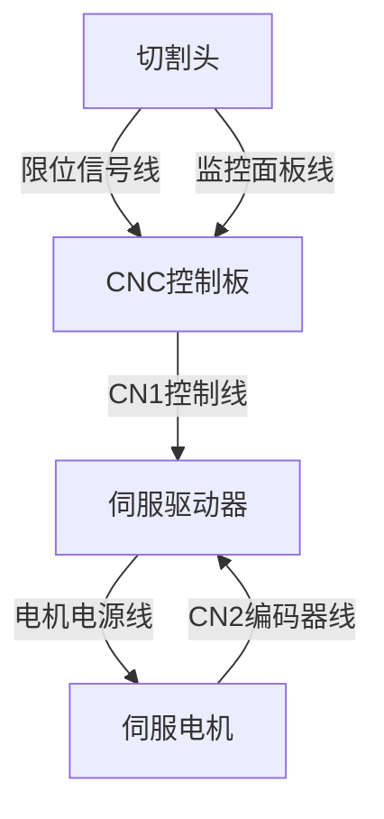

# 上午

## 装激光器

1. 装切割头
2. 接水管
接好水管后如果显示水流量不够可能是管中混入了空气，重复启停多次后再观察
3. 接线
接模拟量，出光使能，调制，以及外控出光（接中继器控制）
4. 激光监控软件
修改网段后如果还是连不上后考虑更换监控软件，如果是锐科激光器或者某些型号的创鑫激光器可以考虑手机连接出光
5. 打相纸检测光路
1000w 100% 5000hz放在齿条上来打，如果有污染后检查镜片

新机开机报错双驱差异过大，如果是8000系统可以打开y轴检测电机方向，然后自动修改后就可以解除这个报警了

激光器水流量报警可以通过账号密码登录激光器后台修改水流量报警值

# 下午

## 接雷赛H506伺服驱动

## 焊线的几个要点

1. 大热缩管和小的都需要套
2. 公母头要先区分开
3. 先深色单色，后浅色双色
4. 接口的顺序不能错，一般接口上都会有数字标明每pin是第几个